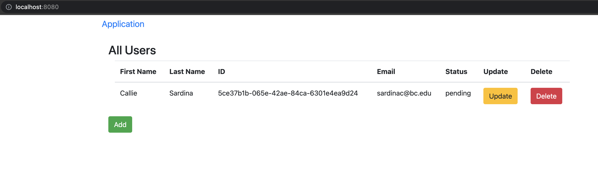
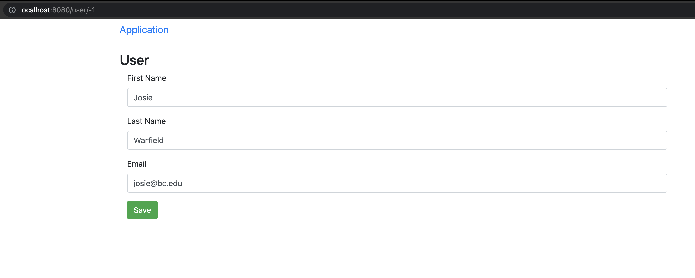
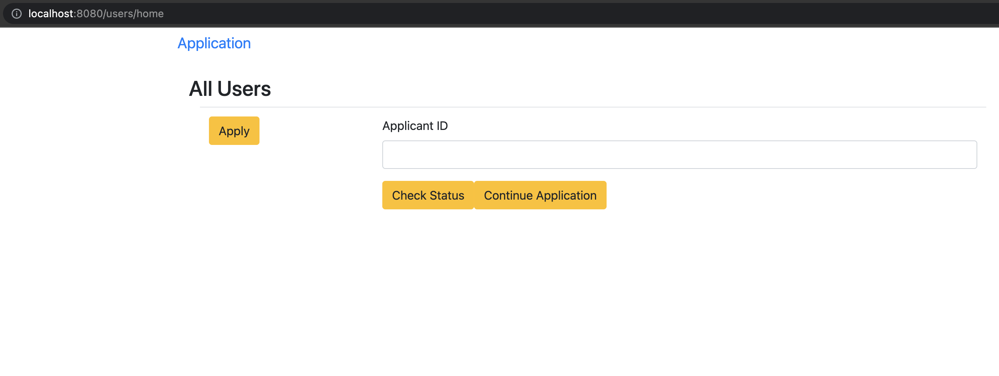
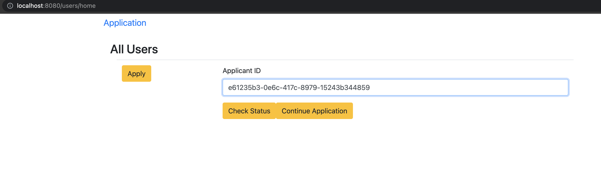
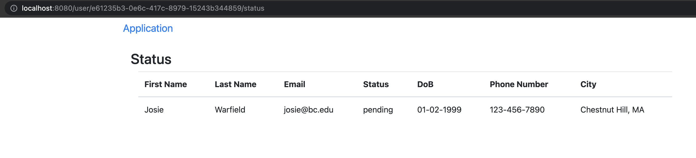
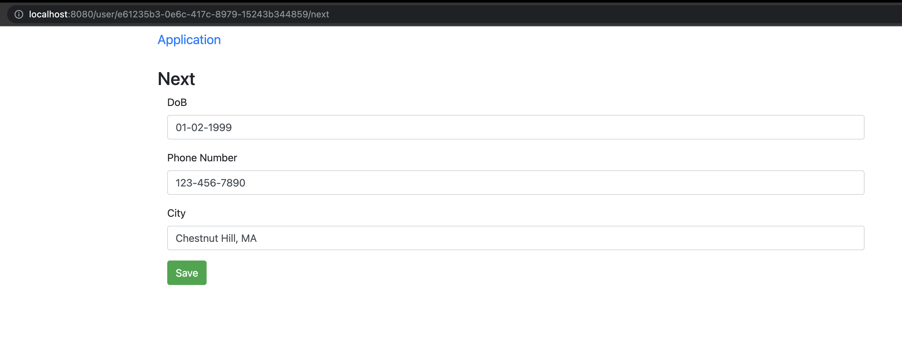
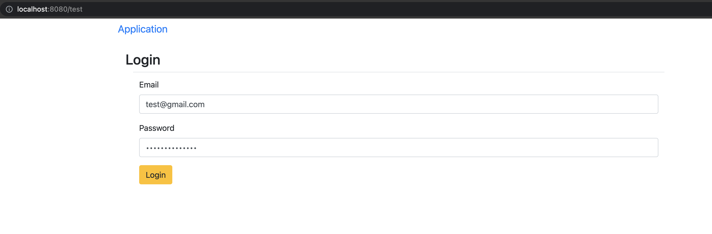

# student-backend

This project provides a foundational backend implementation for automating GiveCard's application and registration process. It uses Golang for the backend and Vue/ js for the frontend. User data is persisted to a postgresql database configured and running locally for testing purposes. Implementation with Firebase to create authenticated user accounts is currently in progress. With this app, the user can create an application, add additional personal information, and check the status of their application.

## Backend

### Build & Run

Build with command: go build main.go

Run with command: go run main.go 

(This will start the HTTP server on port 9080)

## Frontend

### Build & Run

Build with command: npm run build

Run with command: npm run serve

(This will start the Vue App running at http://localhost:8080/)

## Endpoints

http://localhost:8080/users 
- Displays a list of all users.
- Can add new user/ update existing users/ delete users from this page.
    - When a user is added from this page, it initially routes to the http://localhost:8080/user/${id} page with an id of -1. However, this is more for manual addition of applicants as this page holds all user information and should not be accessible by anyone outside of GiveCard.
    - "Update" routes the user to http://localhost:8080/user/${id}/next (see below).
    - "Delete" deletes the user from the database. 
- This should not bevisible to the applicants, but may be a useful tool for GiveCard to manage the applications.

http://localhost:8080/users/home
- From this home page, users can either apply, check the status of their application, or continue filling out their application.
    - "Apply" routes the user to the ttp://localhost:8080/user/${id} page with an id of -1, as above.
    - "Continue Application" will route the user to http://localhost:8080/user${id}, and subsequently to http://localhost:8080/user/${id}/next (see corresponding endpoint below) to add additional information (birthdate, phone number, and city) to their applocation.
    - "Check Status" will route the user to http://localhost:8080/user/${id}/status (see corresponding endpoint below).

http://localhost:8080/user/${id} 
- Displays user's application.
- This will be the application which the user is directed to when they want to fill out an application (from a page which says i.e. "Apply").
- From here, the user can fill out the entire application (inclusing additional information), and then is routed to the status page.

http://localhost:8080/user/${id}/status
- Displays the status page for a specific user.
- This will be the information page which the user can check the status of their application.

http://localhost:8080/user/${id}/next
- Displays the next page of the application where the user can input their addiitonal information (DoB, Phone Number, and City).

http://localhost:8080/test 
- This is the test page I was creating to troubleshoot integrating the project with firebase. Currently, upon hitting "Login", nothing happens, but hopefully, from here, I will be able to create a user account from which we can obtain a unique user ID to identify a user and make the above routing more seamless.

http://localhost:8080/users/login
- Will be connected to LoginView.vue.

